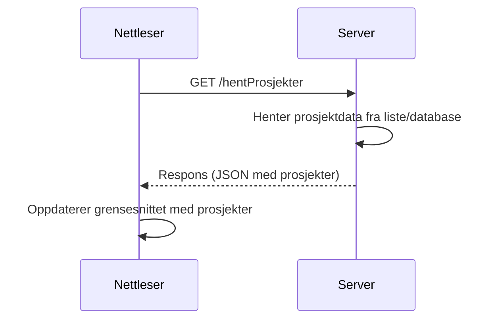

```mermaid
sequenceDiagram
    participant Nettleser
    participant Server

    Nettleser->>Server: GET /hentProsjekter
    Server->>Server: Henter prosjektdata fra liste/database
    Server-->>Nettleser: Respons (JSON med prosjekter)
    Nettleser->>Nettleser: Oppdaterer grensesnittet med prosjekter
```