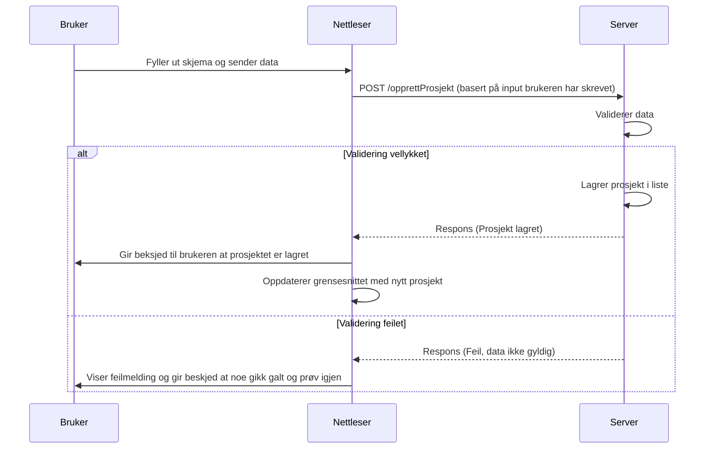

```mermaid
sequenceDiagram
    participant Bruker
    participant Nettleser
    participant Server

    Bruker->>Nettleser: Fyller ut skjema og sender data
    Nettleser->>Server: POST /opprettProsjekt (basert på input brukeren har skrevet)
    Server->>Server: Validerer data

    alt Validering vellykket
        Server->>Server: Lagrer prosjekt i liste
        Server-->>Nettleser: Respons (Prosjekt lagret)
        Nettleser->>Bruker: Gir beksjed til brukeren at prosjektet er lagret
        Nettleser->>Nettleser: Oppdaterer grensesnittet med nytt prosjekt
    else Validering feilet
        Server-->>Nettleser: Respons (Feil, data ikke gyldig)
        Nettleser->>Bruker: Viser feilmelding og gir beskjed at noe gikk galt og prøv igjen
    end
```